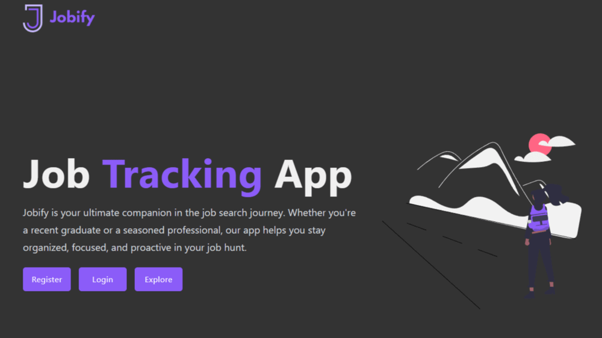
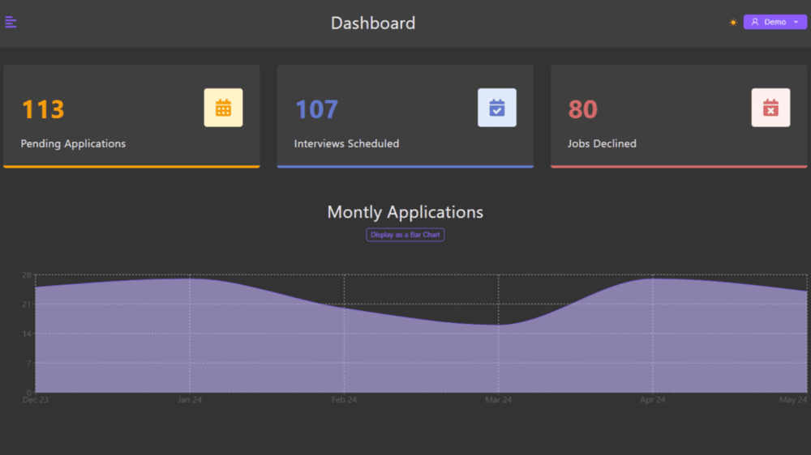
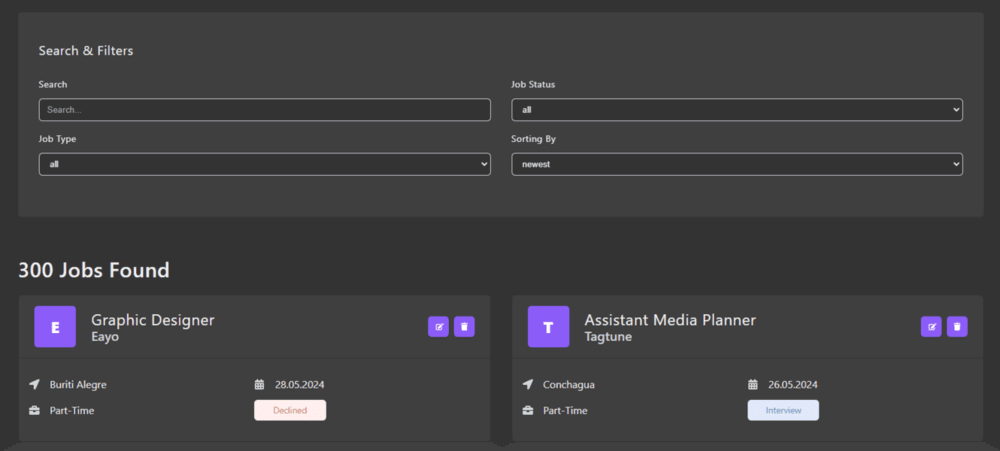

# Jobify | Job Tracking App

- Job tracking app built with the MERN stack & React Query.

## Screens






## Features

- JWT
- Pagination
- Search and filter
- CRUD operations
- Job list with cache functionality
- Admin and Demo User functionality
- Database seeder with 300 Mock Data
- User profile with detailed stats and graphs

## Usage

#### Accounts

1.  Create a [MongoDB database](https://www.mongodb.com/cloud/atlas/register) and obtain your `MongoDB URI`.

2.  Create a [Cloudinary account](https://cloudinary.com/users/register_free) and obtain your `CLOUDINARY_NAME`, `CLOUDINARY_API_KEY`, and `CLOUDINARY_API_SECRET`.

#### Env Variables

3. Create the `.env` file with following variables:

```
NODE_ENV = development
PORT = 5100
JWT_EXPIRES_IN=1d
JWT_SECRET = [SECRET]
MONGO_URI = [MONGO_DB_URI]
CLOUDINARY_NAME=[YOUR_API_NAME]
CLOUDINARY_API_KEY=[YOUR_API_KEY]
CLOUDINARY_API_SECRET=[YOUR_API_SECRET]
```

4. Change the `JWT_SECRET` and `JWT_EXPIRES_IN` to what you want.

#### Install Dependencies

```
npm install
cd frontend
npm install
```

#### Run

```

# Run frontend (:5173) & backend (:5100)
npm run dev

# Run backend only
npm run server
```

#### Build & Deploy

```
# Create frontend prod build
cd frontend
npm run build
```

#### Seed Database

5. You can use the following commands to seed the database.

```
npm run populate
```

---

## License

This project is licensed under the [MIT License](./LICENSE).
